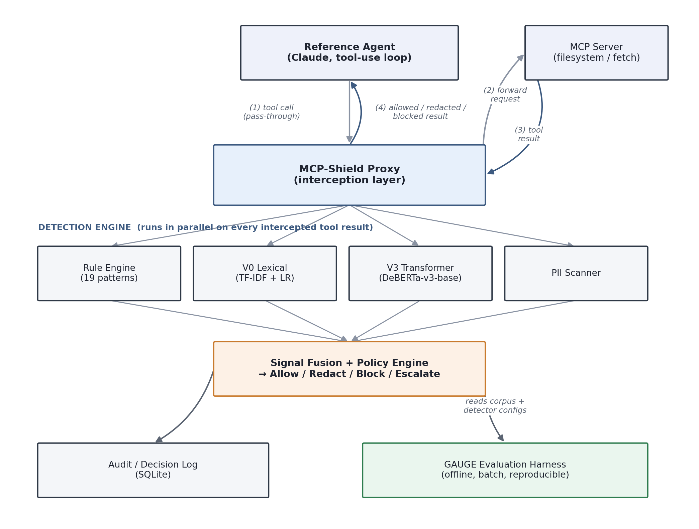

# Document Control

| Field | Detail |
|---|---|
| Project name | LLMShield-MCP (working title; also referred to as MCP-Shield) |
| Document type | MVP technical proposal — trimmed to must-have requirements only |
| Prepared for | Hashir Ahmed |
| Status | Draft — defines the minimum buildable version, not every possible feature |
| Relationship to full proposal | This document is a scoped-down version of the complete project proposal. Every should-have and nice-to-have item from the full version is listed in Section 15 (Deferred to Post-MVP) rather than deleted, so nothing is lost — it is simply not required for a first working version. |

---

# 1. Project Overview and Objectives

## 1.1 Overview

LLMShield-MCP extends the author's existing LLMShield guardrail middleware and GAUGE evaluation protocol from the user-prompt injection surface to the **Model Context Protocol (MCP) tool-result surface**. When an MCP-connected agent calls a tool (a file read, a web fetch), the result is inserted directly into the model's context. This project builds a gating layer that inspects tool results before they reach the model, reusing the author's existing detection components, and evaluates it with the same statistical rigor as the author's dissertation.

## 1.2 MVP Objectives (Must-Have Only)

1. Determine empirically whether detectors trained on user-prompt injection transfer to injection delivered via MCP tool results.
2. Build a working interception layer for at least two reference MCP servers that classifies every tool result and applies one of four decisions: Allow, Redact, Block, Escalate.
3. Run the GAUGE protocol on this surface: decontaminated corpus, matched-FPR comparison, dual benign references, threat-type disaggregation, and a leave-one-source-out generalisation test.
4. Benchmark gating latency per tool call and across a multi-call agent chain.
5. Publish a public evaluation harness and payload corpus, with a README stating the headline numbers in plain English.

Everything beyond this — an admin API, a local dashboard, a hosted demo, cascade detection — is explicitly deferred (Section 15) and not required to call the project complete.

---

# 2. Problem Statement

Guardrail research, including the author's own MSc dissertation, has concentrated on the user-prompt injection surface. That work showed lightweight guardrails collapse against open-world adversarial content at a matched false-positive rate (98.6% attack success rate for a fused lightweight detector). It is unknown whether the same detectors, applied unmodified to MCP tool-result content, transfer at all — tool results are longer, more heterogeneous, and legitimately contain trigger words (e.g., "ignore," "system") in benign technical contexts such as source code. Without evidence on this surface, any claim that an application is "protected" because it guards user input is incomplete.

---

# 3. Project Scope (MVP)

## 3.1 In Scope

- Gating of MCP **tool results** (not tool call requests) for two reference MCP servers: filesystem and web-fetch.
- Reuse of the existing rule engine, V0 (lexical) classifier, V3 (transformer) classifier, and PII scanner — no retraining.
- A decontaminated payload corpus (low hundreds of items) built with the existing MinHash decontamination method.
- A policy-as-code fusion/decision layer (Allow / Redact / Block / Escalate) configurable without code changes.
- Audit logging of every decision.
- A minimal reference agent used only to host realistic tool-call chains for evaluation — not a shippable product.
- The full GAUGE evaluation: decontamination, matched-FPR comparison, dual benign references, threat-type disaggregation, leave-one-source-out test.
- Latency benchmarking per call and across a multi-call chain.
- A public GitHub repository with the harness, corpus, and a written report.

## 3.2 Out of Scope for MVP

Everything not listed above, including (see Section 15 for the full deferred list): an administrative REST API, a local results dashboard, a hosted public demo, tiered/cascade detection, a fine-tuned MCP-specific model, multi-turn injection tracking, non-English/non-text payloads, and any transport beyond local stdio and reachable HTTP+SSE servers.

---

# 4. User Roles and Permissions

Single-operator research tool, not a multi-tenant product.

| Actor | Access |
|---|---|
| Operator (the author) | Full local access to configuration, corpus, logs, code |
| Reviewer (optional) | Read-only access to the public repository |
| Protected application / MCP server (system actors) | Send/receive MCP messages through the proxy only; cannot alter policy |

---

# 5. Core Features and Modules (Must-Have)

1. **MCP Interception Layer** — intercepts tool results between the reference agent and the MCP server.
2. **Detection Engine** — rule engine, V0 lexical classifier, V3 transformer classifier, PII scanner, each an interchangeable adapter.
3. **Signal Fusion and Policy Engine** — combines detector outputs into one decision via a versioned config file.
4. **Audit and Decision Logging** — structured log of every decision.
5. **Payload Corpus and Decontamination Pipeline**.
6. **GAUGE Evaluation Harness** — matched-FPR calibration, dual benign references, threat-type disaggregation, leave-one-source-out test, confidence intervals, significance tests.
7. **Reference Agent and Two MCP Servers** — filesystem and web-fetch.
8. **Latency Benchmark**.
9. **Reporting** — tables and plots generated from a completed evaluation run (a script, not a UI).

---

# 6. Functional Requirements (FR) — Must-Have Only

| ID | Requirement |
|---|---|
| FR-1 | Intercept every tool result from a monitored MCP server before it reaches the calling agent. |
| FR-2 | Run the rule engine, V0 lexical classifier, and PII scanner against every intercepted tool result. |
| FR-3 | Run the V3 transformer classifier against every intercepted tool result (configurable always-on). |
| FR-4 | Fuse detector outputs into exactly one decision: Allow, Redact, Block, or Escalate. |
| FR-5 | On Redact, remove/mask only the offending span(s), preserving the rest of the content. |
| FR-6 | On Block, replace the tool result with a safe, clearly-labelled refusal payload. |
| FR-7 | On Escalate, pass content through (per policy) and flag the interaction for human review. |
| FR-8 | Log every decision: timestamp, correlation ID, MCP server, tool name, detector scores, fused decision, latency. |
| FR-9 | Support policy configuration (thresholds, active detectors, fail-open/fail-closed) via a versioned file, no code changes. |
| FR-10 | Provide corpus management: add, label (benign/adversarial, threat type), decontaminate new items. |
| FR-11 | Run the full GAUGE pipeline against a detector configuration and corpus: matched-FPR ASR by threat type, with confidence intervals. |
| FR-12 | Run a leave-one-source-out generalisation test. |
| FR-13 | Benchmark and report per-call latency for each detector variant and the fused pipeline. |
| FR-14 | Benchmark end-to-end overhead across a chain of at least 20 sequential tool calls. |
| FR-15 | Pass through MCP protocol-level error responses without content-based detection. |
| FR-16 | Enforce a configurable maximum tool-result size for detection, with a defined truncation/size policy for oversized results. |

---

# 7. Non-Functional Requirements (NFR) — Must-Have Only

| ID | Requirement |
|---|---|
| NFR-1 | Lexical/rule detection path adds no more than ~5 ms latency per tool result on commodity CPU hardware. |
| NFR-2 | Transformer path latency is measured and reported honestly against the sub-100 ms SME budget, even if not met. |
| NFR-3 | Never execute, evaluate, or act on content contained in a scanned tool result. |
| NFR-4 | PII detected in a tool result is redacted or hashed before being written to any log. |
| NFR-5 | Handle at least 20 sequential tool calls in one session without memory growth or state leakage. |
| NFR-6 | The evaluation pipeline runs fully offline/in-batch. |
| NFR-7 | Every statistical figure reported (ASR, FPR, AUROC) carries a confidence interval, never a bare point estimate. |
| NFR-8 | Dependencies are version-pinned; no dynamic execution of externally sourced content. |

---

# 8. System Workflows

## 8.1 Gating Workflow

1. Reference agent issues a tool call; the request passes through unmodified.
2. The MCP server executes the tool and returns a result.
3. The interception layer captures the result and runs it through all active detectors in parallel.
4. The fusion/policy engine produces one decision.
5. The (possibly modified) result is returned to the agent; the decision, scores, and latency are logged.

## 8.2 Evaluation Workflow (GAUGE)

1. Assemble/update the payload corpus (benign-realistic, benign-adversarial-styled, adversarial), labelled by threat type and source.
2. Run MinHash decontamination against the detectors' training data; record how many items were dropped.
3. Calibrate thresholds to a fixed matched FPR against the benign reference sets.
4. Run the full corpus through the pipeline; compute ASR and FPR by threat type.
5. Hold out one payload-source family and evaluate it separately.
6. Compute confidence intervals and significance tests.
7. Generate the report (tables, plots).

---

# 9. Technical Requirements

- The interception layer must be transparent to both the MCP client and server (configuration only, no code changes to either).
- Detection components must be independently usable for ablation studies via configuration alone.
- All statistical computations use established library implementations (Wilson, Clopper-Pearson, McNemar, DeLong), not hand-rolled formulas.
- The system must run on CPU-only hardware for the lexical/rule path.

---

# 10. Recommended Technology Stack (MVP)

| Layer | Recommendation |
|---|---|
| Language | Python 3.11+ |
| MCP integration | Official Python MCP SDK |
| Reference model | Anthropic Claude API (Messages API, tool use) |
| Lexical classifier (V0) | scikit-learn (TF-IDF + logistic regression) — reused, not retrained |
| Transformer classifier (V3) | HuggingFace Transformers, DeBERTa-v3-base — reused, not retrained |
| Decontamination | `datasketch` (MinHash/LSH) |
| Statistics | `statsmodels`, `scipy` |
| Reference MCP servers | Official MCP filesystem server; official MCP fetch server |
| Storage | SQLite |
| Packaging | pip-installable package plus CLI entry point |
| Testing | `pytest` |
| CI | GitHub Actions (lint, type-check, test suite) |

**Not required for MVP:** FastAPI admin service, Streamlit dashboard, Docker packaging — see Section 15.

**Open question carried over:** GPU availability for faster corpus-scale V3 inference (CPU-only is sufficient, just slower).

---

# 11. System Architecture

## 11.1 Architectural Approach

Two candidate interception points exist: **(A)** a protocol-level proxy speaking MCP JSON-RPC on both sides, or **(B)** a client-side wrapper around the reference agent's own tool-result handling.

**Recommendation:** build (A), the protocol-level proxy — framework-agnostic and closer to how gating would be added to a real deployment without modifying the agent. **Open question:** confirm this against real MCP transport behaviour (especially HTTP+SSE) before finalising; (B) is the documented fallback.

{.arch-diagram}

## 11.2 Data Flow Summary

1. Tool call requests flow through unmodified.
2. Tool results are intercepted, scanned in parallel, fused into a decision, optionally modified, forwarded.
3. Every decision is logged independently of the request/response path.
4. Evaluation runs operate offline against the stored corpus.

---

# 12. Database Requirements and Data Model

SQLite, sufficient for a single-operator tool.

**DecisionLog** — `id`, `timestamp`, `correlation_id`, `mcp_server_id`, `tool_name`, `request_id`, `raw_result_hash`, `detector_scores` (JSON), `fused_decision`, `redacted` (bool), `latency_ms`.

**PayloadCorpusItem** — `id`, `source`, `threat_type`, `label`, `text`, `decontamination_status`, `minhash_signature`, `added_at`.

**EvalRun** — `id`, `run_at`, `config_hash`, `detector_variant`, `fpr_target`, `metrics` (JSON), `held_out_source`.

**PolicyConfig** — `id`, `version`, `yaml_blob`, `active` (bool), `created_at`.

Raw tool-result content is not retained in the decision log by default (a hash is stored instead), to avoid the audit store becoming a repository of adversarial content.

---

# 13. API Requirements

**None required for MVP.** The proxy's function is protocol-level (MCP JSON-RPC), and all operator interaction (policy edits, corpus management, running evaluations) happens via the CLI and direct file/config edits. A REST admin API is deferred (Section 15).

---

# 14. Third-Party Integrations

- Anthropic Claude API (reference agent).
- Official MCP SDK and reference servers (filesystem, fetch).
- HuggingFace Transformers (V3), scikit-learn (V0).
- `datasketch` for decontamination; `statsmodels`/`scipy` for statistics.

**Open question:** confirm reuse rights over the existing (currently private) LLMShield code and trained models before implementation begins — this affects both what can be built on and what can eventually be published.

---

# 15. AI/ML Requirements

No new model training required. The evaluation must explicitly test and report the transfer gap (or lack thereof) between prompt-level and tool-result-level injection, using the same matched-FPR methodology as the dissertation. A well-evidenced negative result ("existing detectors do not transfer") is a legitimate, valuable MVP outcome — not a failure requiring a retrain to fix.

---

# 16. Security Requirements

| ID | Requirement |
|---|---|
| SEC-1 | Never execute, interpret, or follow instructions in scanned tool-result content. |
| SEC-2 | Enforce a maximum content size for detection to prevent denial-of-service via oversized results. |
| SEC-3 | Redact or hash PII before writing it to any log. |
| SEC-4 | Sandbox the reference filesystem MCP server to a dedicated directory. |
| SEC-5 | Use TLS for any remote (HTTP+SSE) MCP transport. |
| SEC-6 | Fail-closed (Block/Escalate) on detector failure, with the failure logged distinctly — an explicit, documented policy choice. |

---

# 17. Performance, Scalability, and Reliability Requirements

- Lexical/rule path: sub-~5 ms target; transformer path latency measured and reported honestly (this is itself an evaluation question, not a target to force).
- Handle 20+ sequential tool calls without memory growth or state leakage.
- Fully offline/batch-reproducible evaluation.
- Not required to handle concurrent multi-tenant load — sequential/lightly-concurrent load from the reference agent and harness is sufficient.

---

# 18. UI/UX Requirements

None beyond a usable CLI and clearly readable generated reports (tables, plots as static files). No dashboard or hosted demo is required for MVP.

---

# 19. Error Handling and Edge Cases

| Case | Required Behaviour |
|---|---|
| Oversized tool result | Truncate before detection or apply a defined size-based policy; must not crash. |
| Malformed/non-UTF-8 content | Handle with a defined fallback, not an unhandled exception. |
| Binary tool results | Not text-scanned; explicit pass-through-but-logged or block-by-default policy, chosen deliberately. |
| Non-English content | Out of scope for detection efficacy; must not crash; limitation stated in the report. |
| Detector load/inference failure | Trigger fail-closed behaviour (SEC-6), logged distinctly. |
| Empty tool result | Treated as benign; no error. |
| MCP protocol-level error response | Passed through without content-based detection. |
| Concurrent/interleaved tool calls | Correlation ID on every call so decisions/logs are attributed correctly. |
| Evasion attempts targeting the proxy (encoding tricks, zero-width characters, homoglyphs) | Explicitly represented as a distinct corpus sub-category. |

---

# 20. Assumptions and Dependencies

- **A1 — Reuse rights.** Assumed the author can reuse existing LLMShield code/models. **Open question:** confirm before committing to this architecture.
- **A2 — API budget.** Assumed sufficient Anthropic API budget for corpus-scale evaluation via the reference agent.
- **A3 — Compute.** CPU-only inference assumed acceptable; GPU would only speed things up.
- **A4 — MCP SDK stability.** Assumed the SDK version used is stable enough to complete the project; spec churn is a risk (Section 21), not a blocker.

---

# 21. Risks and Potential Challenges

| Risk | Mitigation |
|---|---|
| Detectors fail to transfer to the tool-result surface | Frame as a valid, reportable finding (this is Objective 1, not a failure state) |
| MCP spec/SDK changes mid-build | Pin SDK versions; client-side wrapper (11.1 option B) is the documented fallback |
| Legitimate content triggering false positives | Measured directly via the benign-adversarial-styled reference set, not tuned away |
| Transformer latency impractical for real agent loops | Report honestly; cascade detection is a documented but deferred extension |
| Reuse of existing code/models blocked by publication considerations | Resolve A1 early; fallback is rebuilding lighter open equivalents of the rule engine and V0 |

---

# 22. Testing Requirements

- Unit tests for each detector adapter and the fusion/policy logic against a fixed decision table.
- Integration test: end-to-end run of the reference agent through both MCP servers with synthetic injected payloads.
- Corpus correctness test: no near-duplicate above the similarity threshold survives decontamination.
- Statistical correctness tests: known-answer tests for Wilson, Clopper-Pearson, McNemar, and DeLong implementations.
- Regression test against a frozen golden set whenever policy/detector configuration changes.
- Explicit fail-closed test simulating a detector failure.
- Reproducible latency benchmark script.

---

# 23. Logging and Monitoring

Every gating decision logged in structured form (Section 12) without retaining raw potentially-sensitive content by default. Detector failures logged distinctly from normal decisions. Each evaluation run's configuration hash is stored alongside its results for traceability.

---

# 24. Deployment Requirements

- Pip-installable Python package with CLI entry points (e.g., `toolgate run`, `toolgate evaluate`, `toolgate report`).
- Full evaluation pipeline runnable end to end via a single documented command or Makefile target.
- No hosted service, Docker packaging, or public demo required for MVP.

---

# 25. Glossary

| Term | Meaning |
|---|---|
| MCP | Model Context Protocol |
| ASR | Attack Success Rate |
| FPR | False Positive Rate |
| GAUGE | Guardrail Assessment Under Generalisation Evaluation (the author's protocol) |
| Leave-one-source-out | Generalisation test withholding one payload-source family from calibration |
| V0 / V3 | The author's existing lightweight and strong trained detectors |

---

# 26. Deferred to Post-MVP (Should-Have / Nice-to-Have)

These are valid, worthwhile extensions — not abandoned — but not required to consider the MVP complete:

- Administrative REST API (FastAPI) for policy/corpus/decision-log management without file access.
- Local interactive results dashboard (Streamlit): ROC-style curves, ASR by threat type, latency distributions.
- Tiered/cascade detection (cheap detector first, expensive transformer only on ambiguous cases) — a strong follow-up if the transformer latency finding motivates it.
- Small hosted public demo (containerised proxy + minimal web UI) for live, interview-friendly demonstration.
- Fine-tuned, MCP-tool-result-specific transformer detector, if the transfer-gap finding motivates it.
- Expansion to additional MCP servers (database, chat/Slack tools, browser automation).
- Multi-turn, session-level injection tracking.
- Adapters for other agent frameworks (LangChain, LlamaIndex, OpenAI Agents SDK).
- Formal workshop/technical-report submission of the findings.
- Dockerised build for reviewers without a matching local Python environment.
- OpenTelemetry-compatible structured log export for future integration into a larger system.

---

# 27. Acceptance Criteria (MVP)

1. The interception layer functions transparently for both reference MCP servers without breaking normal tool operation.
2. The full GAUGE protocol has been run end to end, producing matched-FPR ASR figures disaggregated by threat type, each with a confidence interval.
3. The leave-one-source-out generalisation test has been run and reported.
4. Latency is benchmarked and reported per tool call and across a multi-call chain, for each detector variant.
5. Every gating decision made during evaluation is captured in the audit log.
6. The payload corpus is decontaminated and documented with provenance.
7. A public repository exists with the harness, the corpus, and a README stating the headline numbers in plain English.
8. Findings are reported honestly, including a negative or partial result if that is what the evaluation shows.

---

*End of MVP Proposal 1.*
