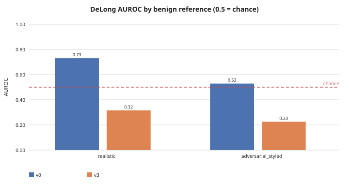
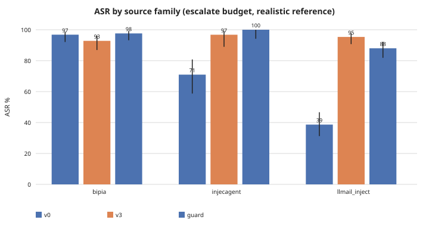
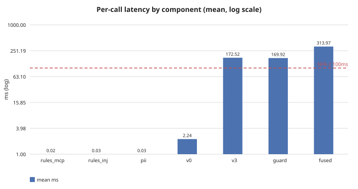

# LLMShield-MCP: does prompt-injection detection transfer to the MCP tool-result surface?

This is the headline report AC-7 asks for: what was measured, what it says,
and what it does not say. Every number below traces to a script under
`scripts/` or `mcp-shield`'s own subcommands and is reproducible from the
committed corpus and code -- the reused model weights are the only
unreproducible input (`prd.md` A1), and every evaluation run emits a
per-item `scores.csv` specifically so the statistics recompute without them
(`plan.md` section 2.6).

**Headline answer: no, not reliably, and the failure is not uniform.** The
best single signal (a small set of rules derived from real attack data, not
the reused classifiers) catches roughly one attack in five. The reused
transformer classifier (V3) separates real attacks from ordinary benign
content *worse than random guessing* on this surface. And whatever partial
signal exists does not generalise across attack sources: the same detector,
the same threshold, produces attack-success rates from 40% to 98% depending
purely on which of three independent real-world attack collections is being
measured.

---

## 1. What this system is

An interception layer sits at the MCP client's transport boundary and
inspects every tool result before it reaches the agent (`plan.md` 2.1). Four
detectors run against every result: a frozen 19-rule set ported from the
author's dissertation (`INJ-*`), a 6-rule set derived from real MCP-surface
attack data (`MCP-*`), a PII scanner, and two reused-not-retrained
classifiers (V0, a TF-IDF+logistic-regression model; V3, a DeBERTa-v3-base
transformer). A policy engine fuses their scores into one of four decisions
-- Allow, Redact, Block, Escalate -- and every decision is logged.

**This is a detection and audit layer with measured, poor coverage, not a
guardrail that blocks attacks** (`plan.md` 2.16). That framing is not a
disclaimer added after the fact; it is the actual finding, and the rest of
this report is the evidence for it.

## 2. The corpus

337 real adversarial items across three independent, disjoint source
families, ingested and decontaminated against V0/V3's own training data
(`mcp-shield corpus-ingest`, M6):

| Source | Items | What it is |
|---|---|---|
| [BIPIA](https://github.com/microsoft/BIPIA) | 125 | Attacker objectives across 25 categories (Microsoft, MIT) |
| [InjecAgent](https://github.com/uiuc-kang-lab/InjecAgent) | 62 | Attacker instructions, direct-harm and data-stealing (MIT) |
| [LLMail-Inject](https://huggingface.co/datasets/microsoft/llmail-inject-challenge) | 150 | Sampled from 462,000 real submissions to a live adaptive prompt-injection competition (Microsoft, MIT) |

**Zero items from any of the three were flagged contaminated** against the
~19,000-row corpus V0/V3 were actually trained on -- these are genuinely
independent test data, not accidentally-recycled training examples.
Benign reference content (~7,800 lines) comes from this repository's own
real source, docs and sandbox content, split into two references PROPOSAL.md
asks for: ordinary text, and text that legitimately contains
detector-relevant vocabulary without being an attack (the false-positive
stress case -- `gauge/references.py`).

## 3. Rule recall: the ported rules do not transfer; new ones, derived from data, do a little

The dissertation's 19 rules (`INJ-*`), applied unmodified to this surface,
catch **0 of 187** real indirect-injection payloads (BIPIA + InjecAgent) and
produce every rule false positive measured. Six new rules
(`MCP-*`), derived by discriminative analysis over the same benchmarks
against ~5,000 benign lines -- never by hand-writing cases, which measures
the author's own assumptions rather than reality (`docs/POLICY-AUDIT.md`
section 2) -- reach **20.3% recall at 0% false positives**. `INJ-*` stays
enabled and scored specifically so this zero keeps being reported every run,
not because it does anything.

## 4. Matched-FPR calibration and separation (GAUGE, M7)

V0 and V3 were calibrated against this project's own benign reference sets
at matched false-positive-rate budgets (0.1% / 1% / 5%), not against an
inherited threshold from the user-prompt surface they were trained for
(`docs/POLICY-AUDIT.md` section 4 measured why that would be unsafe: an
inherited `ml_probability >= 0.95` breaker hard-blocks 7 of 8 benign
documents on this surface).



Threshold-free separation (DeLong AUROC, 95% CI) tells the same story
without needing any threshold at all:

| Detector | Realistic benign | Adversarial-styled benign |
|---|---|---|
| V0 | 0.73 [0.69, 0.77] | 0.53 [0.47, 0.59] |
| V3 | 0.32 [0.27, 0.36] | 0.23 [0.18, 0.27] |

**V3 separates real attacks from ordinary benign content worse than a coin
flip on both references.** V0 is directionally useful against realistic
content but collapses to indistinguishable-from-chance against text that
merely *looks* suspicious -- exactly the false-positive stress case a
detector most needs to survive.

## 5. Leave-one-source-out: the generalisation gap (FR-12, M8)

The dissertation's own leave-one-out protocol retrains a classifier with and
without each benchmark family. This project never retrains V0/V3
(`plan.md` 2.20), so the meaningful question here is narrower: does the
*same* calibrated threshold produce consistent recall across independent
attack sources, or not?



At the escalate budget (5% target FPR, realistic benign reference), attack
success rate (Wilson 95% CI) -- the same detector, the same threshold,
against three genuinely disjoint real-world sources:

| Source | V0 ASR | V3 ASR |
|---|---|---|
| BIPIA | 97.6% [93.2%, 99.2%] | 92.8% [86.9%, 96.2%] |
| InjecAgent | 75.8% [63.8%, 84.8%] | 96.8% [89.0%, 99.1%] |
| LLMail-Inject | 40.0% [32.5%, 48.0%] | 94.7% [89.8%, 97.3%] |

V0's failure rate swings by **~58 percentage points** depending purely on
which source is measured. A report built from only the first two families
(this project's own state before Q3 was resolved, `plan.md` 2.21) would have
significantly overstated how consistently V0 fails -- and would have missed
that it fails *least* on the family most like a live, adaptive attacker
(LLMail-Inject: real human submissions against real live defenses). V3 is
more uniform (93-97% ASR across all three) but uniformly close to useless
either way -- a different failure shape, not a better one.

## 6. Latency (FR-13, FR-14, M9)



| Component | Mean | vs budget |
|---|---|---|
| `rules_mcp` / `rules_inj` / `pii` | 0.06-0.07 ms | NFR-1 (~5ms): met |
| V0 | 2.07 ms | NFR-1: met |
| V3 | 208.28 ms | NFR-2 (100ms): missed, ~2x |
| Fused pipeline | 215.03 ms | NFR-2: missed, ~2x |

That 2x figure is on short corpus text. Across a real 25-call agent chain
(`chains/latency_chain.json`) gating live fetches of real web pages, V3's
`chunk_max` strategy -- scoring every overlapping window of long content --
pushed gate latency as high as **13.1 seconds** for one page, and for 9 of
16 fetches gate latency exceeded the network round-trip time that produced
the content in the first place. Full breakdown: `docs/LATENCY-BENCHMARK.md`.
Shipping V3 `inert` (below) protects the *decision*; it saves none of this
latency, because the detector runs on every result regardless of its
decision weight.

## 7. Why the system is still designed this way

Given detectors this weak, three design decisions (`plan.md` 2.15) follow
directly from the numbers above, not from caution for its own sake:

- **Max/OR fusion, never weighted-linear averaging.** The four detectors are
  near-orthogonal (pairwise Jaccard 0.00-0.09); averaging weak orthogonal
  signals at ~0.3 weight each cannot cross any useful threshold -- the
  dissertation's own FM-5 failure mode, blamed for 75.7% of its bypasses.
- **V0 and V3 ship `inert`** (scored and logged on every result, zero
  decision weight) rather than promoted on today's numbers. Section 4's
  AUROC-below-chance result is exactly why: an uncalibrated ML score driving
  live decisions on this surface has already been measured to hard-block 7
  of 8 benign documents under one score mode.
- **Escalate, not Block, is the default action on detection.** With the
  majority of real attacks caught by nothing (section 5), a Block-by-default
  policy would pay the full false-positive cost of an imperfect detector
  while still missing most attacks. `calibrated: false` in
  `config/policy.yaml` makes Block structurally unreachable until a real
  calibration run backs it -- enforced in code
  (`PolicyEngine._ceiling`), not just documented.

## 8. What this report does not claim

- No claim that this system blocks attacks reliably. Section 5's own numbers
  are the argument against that claim.
- No claim about non-English content, non-text payloads, or transports
  beyond local stdio and reachable HTTP+SSE (out of scope, `prd.md` 3.2).
- The `MCP-*` rules' 20.3% recall does not generalise evenly across sources
  either (15.2% BIPIA vs 30.6% InjecAgent, `docs/POLICY-AUDIT.md`) -- the
  same generalisation caveat as section 5 applies to the rules, not only the
  classifiers.
- Every figure here is a point-in-time measurement against a "low hundreds"
  corpus. Confidence intervals are reported throughout specifically because
  point estimates alone would overstate precision.

## Reproduce

```bash
uv run mcp-shield corpus-ingest
uv run mcp-shield gauge-run
uv run python scripts/benchmark_latency.py
uv run python scripts/generate_report.py   # regenerates the SVGs in docs/figures/
uv run python scripts/benchmark_rules.py
```

All but the last need the real reused weights (`LLMSHIELD_MODELS_ROOT`) and,
for `gauge-run`/`generate_report.py`, a corpus already produced by
`corpus-ingest`. Exact figures will vary run to run (benign sampling, model
non-determinism in chain recording); the shapes reported above -- rules
transfer poorly but MCP-derived ones do a little, V3 separates worse than
chance, recall does not generalise across sources, V3 dominates fused
latency -- are the reproducible findings.
